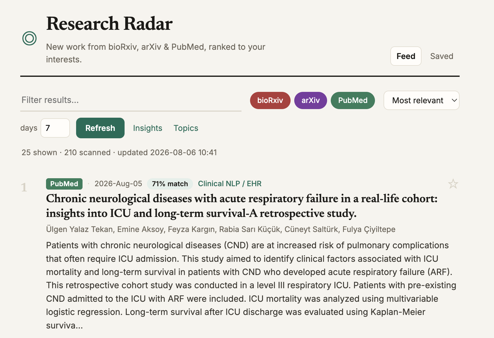

# Research Radar

Keeping up with a fast-moving field means checking bioRxiv, arXiv, and PubMed
separately, every week, and still missing things. Research Radar pulls from all
three at once and ranks what's new against the topics you actually care about,
so the reading list comes to you, already sorted.

**Live:** [research-radar-gold.vercel.app](https://research-radar-gold.vercel.app/) · React · FastAPI



## What it does

Three sources, one feed: bioRxiv, arXiv (q-bio + cs.LG), and PubMed, fetched
concurrently and merged. The same preprint showing up on arXiv and bioRxiv (or
PubMed) collapses into a single card that lists every source it appeared on,
rather than three duplicate entries. Every paper is scored against your topics
by a pluggable ranker (weighted keyword, TF-IDF cosine, or BM25) blended with
an exponential recency boost, and each card shows the breakdown behind its
match percentage, not just the number. Repeat requests for the same window and
topics come back instantly from a short-lived server-side cache instead of
re-hitting three upstream APIs.

The UI itself is a single React view: search within results, toggle sources on
and off, sort by relevance or date, and bookmark papers to a "Saved" tab that
persists in the browser across visits. An insights panel gives client-side
analytics over the current feed (counts by source, top title keywords, papers
per week), and a topics editor lets you tune weights and terms and re-rank on
the spot.

## How the ranking works

Each topic is a weight plus a list of terms. Every paper's score is a blend of
one lexical signal and a recency factor:

```
score = 0.85 * lexical + 0.15 * recency
```

`recency` is an exponential freshness factor that halves every two weeks.
`lexical` is whichever ranker was requested:

- **keyword**: the sum of weighted whole-word term hits across title and
  abstract (title matches counted twice), normalized against the strongest
  match in the batch. Precise, but blind to any paper that describes the same
  work in different words.
- **tfidf**: the whole fetched corpus is vectorized into a TF-IDF space
  (numpy only, no embeddings or model weights), the topic terms become a
  single weighted query vector, and cosine similarity is measured against
  every paper. Catches paraphrases the keyword ranker would miss.
- **bm25**: Okapi BM25 (k1=1.5, b=0.75) over the same corpus. Also catches
  paraphrases, and additionally saturates repeated term frequency (a term's
  10th occurrence barely moves the score past its 1st) and normalizes for
  document length against the corpus average, which TF-IDF cosine only does
  implicitly through vector normalization.

All three build their vocabulary deterministically (sorted, so the same corpus
always ranks the same way) and are exposed through the API's `ranker` query
param; the UI has a selector for it. Each card also shows *why* it matched
(the topics whose exact terms it hit), independent of which ranker produced
the score.

### Which one is the default, and why

TF-IDF is the default. The eval harness described below measures all three on
a fixed, labelled fixture set, and on that set TF-IDF has the best P@10 and
NDCG@10, with keyword and BM25 essentially tied just behind it. That's not the
outcome I expected going in (BM25 is the standard IR baseline for a reason),
but the fixture set is small and cosine similarity may just be a better fit
for short, single-topic-per-query abstracts than for the longer, multi-topic
documents BM25's length normalization is usually built for. BM25 stays
available as an option (and the code is real, tested BM25, not a stub) because
it's worth trying against a larger corpus, and because the eval harness makes
that an experiment you can actually rerun rather than a claim to take on
faith.

## Evaluation

`backend/eval/` is a small, offline, reproducible ranking benchmark:

- `fixtures.py`: 50 hand-written synthetic paper records (title, abstract,
  date) across 4 topic profiles (single-cell genomics, glioma, computational
  neuroscience, clinical NLP), each labelled relevant or not per topic by
  content, not by keyword overlap. About a third of the relevant papers per
  topic are deliberately paraphrased to avoid every literal term in that
  topic's term list, so a keyword-only ranker structurally cannot find them.
  Twelve distractor papers from unrelated fields (drone navigation, climate
  modeling, gravitational waves, and so on) are mixed in, some of them sharing
  generic ML vocabulary ("transformer", "foundation model") with the on-topic
  papers on purpose, to catch a ranker that over-weights jargon it doesn't
  understand.
- `metrics.py`: Precision@k, Mean Reciprocal Rank, and NDCG@k, implemented
  from their definitions.
- `evaluate.py`: scores each ranker against the fixture set and prints a
  table. No network access, no dependency beyond numpy.

```bash
cd backend
python -m eval.evaluate
```

Measured output, run against the fixture set committed in this repo (mean
across the 4 topics):

| ranker  | P@5   | P@10  | MRR   | NDCG@10 |
|---------|-------|-------|-------|---------|
| keyword | 1.000 | 0.775 | 1.000 | 0.877   |
| tfidf   | 1.000 | 0.800 | 1.000 | 0.893   |
| bm25    | 1.000 | 0.775 | 1.000 | 0.882   |

All three put a relevant paper at rank 1 for every topic (P@5 and MRR both
hit the ceiling), so the fixture set mostly separates the rankers on how much
of the deeper recall they capture by rank 10. BM25 does not beat TF-IDF here;
it's within noise of plain keyword matching. I'm reporting that as-is rather
than picking whichever number looked better, both rankers stay in the
codebase, and `python -m eval.evaluate` reproduces the table above from
scratch, on this fixture set, with no external calls.

The eval scores the lexical signal in isolation (`include_recency=False` in
`radar.rank()`), because recency is a freshness heuristic rather than a
relevance judgment, and folding it in would make the reported numbers depend
on how many days old the fixture set's fixed dates happen to be relative to
whenever the script runs.

## Caching

`/api/papers` is backed by a small stdlib TTL cache (`backend/cache.py`) keyed
by `(days, hash of the current topics, ranker)`. A request that only changes
the display `top` count reuses whatever's cached rather than re-fetching, since
the cache stores the full ranked set and slices it per request. The TTL
defaults to 10 minutes and is configurable via `RADAR_CACHE_TTL`; `?refresh=1`
on the request bypasses a cache hit for that call. Saving new topics clears the
cache immediately, since the ranking they'd produce is now stale.

## De-duplication

Records are merged when they share a DOI (pulled from the link) or a
normalized title (case, punctuation, and whitespace stripped). The survivor
keeps the union of sources, so a card can read "bioRxiv · arXiv", and the
longest abstract seen.

## Architecture

`backend/radar.py` is the engine: fetch, then `rank()`, a pure function with no
network I/O that both the live API and the offline eval harness call, so eval
numbers describe the real ranking code rather than a reimplementation of it.
`backend/main.py` is a thin FastAPI layer with the TTL cache described above.
`backend/eval/` is the standalone evaluation harness. The frontend is a single
React view; results, filtering, and bookmarks are all derived client-side from
one fetch.

## Run locally

```bash
# backend
cd backend && pip install -r requirements.txt && uvicorn main:app --reload

# frontend (second terminal)
cd frontend && npm install && npm run dev
```

Open the frontend and search a term like `CD3D` or `single-cell` to see it rank.

## Tests

```bash
cd backend
pytest              # keyword scoring, TF-IDF/cosine, BM25, dedup, cache, and metrics
python -m eval.evaluate   # ranking-quality table (see Evaluation above)
```

## License

MIT
