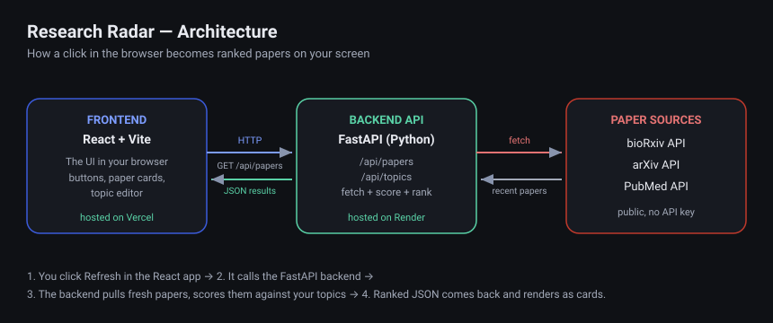

# 🔭 Research Radar

A full-stack web app that surfaces the newest papers from **bioRxiv, arXiv, and
PubMed**, scores each one against your research interests, and shows them ranked
so you never miss relevant work. Built because keeping up with fast-moving fields
(single-cell genomics, ML-for-bio) by hand is impossible.

<!-- After you deploy, paste your live link here 👇 -->
**Live demo:** [research-radar-gold.vercel.app](https://research-radar-gold.vercel.app/) · **Tech:** React · FastAPI · Python


---

## What it does

- Pulls recent papers from three sources in one place (no more checking each site).
- **Ranks by relevance** to *your* topics using a transparent keyword-weighting
  score — a scGPT/glioma paper outranks a generic ML paper for a computational
  biologist, automatically.
- Lets you **edit your topics and weights in the UI** and instantly re-rank.
- Shows *why* each paper matched, so the ranking is never a black box.

## Architecture



A **React** frontend (the UI) talks over HTTP to a **FastAPI** backend (the
server), which fetches papers from the public bioRxiv / arXiv / PubMed APIs,
scores them, and returns ranked JSON. The two halves deploy independently:
frontend on Vercel, backend on Render.

## Tech stack

| Layer | Tech | Why |
|-------|------|-----|
| Frontend | React + Vite | Industry-standard UI library; Vite = fast dev + builds |
| Backend | FastAPI (Python) | Clean async API with auto-generated docs |
| Data | bioRxiv / arXiv / PubMed REST APIs | Free, public, no API key |
| Tests | pytest | Unit tests on the ranking logic |
| CI | GitHub Actions | Auto-runs tests + build on every push |

## Run it locally

**Backend** (terminal 1):
```bash
cd backend
pip install -r requirements.txt
uvicorn main:app --reload
# API now at http://localhost:8000  —  try http://localhost:8000/docs
```

**Frontend** (terminal 2):
```bash
cd frontend
npm install
npm run dev
# App now at http://localhost:5173
```

Open http://localhost:5173 and hit **Refresh**.

## How the ranking works

Each topic in `backend/topics.json` has a `weight` and a list of `terms`. For
every paper, the backend counts weighted keyword matches in the title (counted
twice) and abstract. Papers with a score of 0 are dropped; the rest are sorted
high-to-low. It's deliberately simple and explainable — see `backend/radar.py`.

## Tests

```bash
cd backend && pytest
```

## Deploying

See **[DEPLOY.md](DEPLOY.md)** for a step-by-step, beginner-friendly guide to
putting this on the real internet with a public URL (free).

## Roadmap

- [ ] One-line LLM summaries of each abstract
- [ ] "Only show papers I haven't seen" (a small database)
- [ ] Save/bookmark papers
- [ ] Email me a weekly digest
- [ ] Author/lab watchlist

## License

MIT — see [LICENSE](LICENSE).
